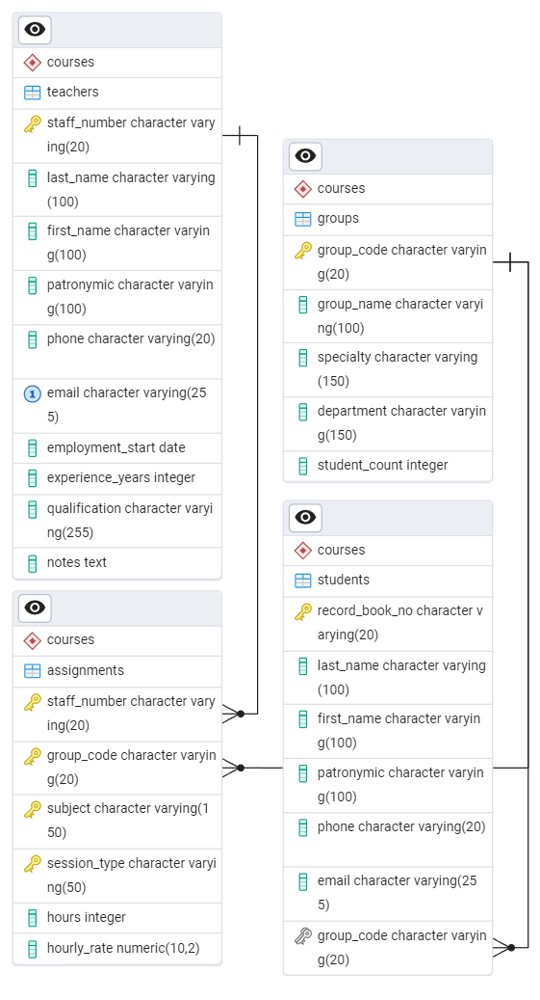

# Лабораторные работы

## Запуск
```bash
    mvn clean
    mvn package
    java -jar target/courses-1.0-SNAPSHOT.jar
```

## Тема

Курсы повышения квалификации Описание предметной области Вы работаете в учебном заведении и занимаетесь организацией курсов повышения квалификации. В вашем распоряжении имеются сведения о сформированных группах студентов. Группы формируются в зависимости от специальности и отделения. В каждую из них включено определенное количество студентов. Проведение занятий обеспечивает штат преподавателей. Для каждого из них у вас в базе данных зарегистрированы стандартные анкетные данные (фамилия, имя, отчество, телефон) и стаж работы. В результате распределения нагрузки вы получаете информацию о том, сколько часов занятий проводит каждый преподаватель с соответствующими группами. Кроме того, хранятся сведения о типе проводимых занятий (лекции, практика), предмете и оплате за 1 час.

### БД



### Выбранный класс

Была выбрана сущность Teacher, дигармма будущих калссов.


### 2–4. Класс Teacher с инкапсуляцией и валидацией

```java
package ru.yourorg.cources.model;

import java.time.LocalDate;

public class Teacher extends Person {
    private final String staffNumber;
    private final LocalDate employmentStart;
    private final int experienceYears;
    private final String qualification;
    private final String notes;

    private Teacher(String staffNumber, String lastName, String firstName, String patronymic,
                    String phone, String email, LocalDate employmentStart, int experienceYears,
                    String qualification, String notes) {
        super(lastName, firstName, patronymic, phone, email);
        this.staffNumber = Validators.requireNonEmpty(staffNumber, "Табельный номер");
        this.employmentStart = Validators.requireNotFuture(employmentStart, "Дата начала работы");
        this.experienceYears = Validators.requireNonNegative(experienceYears, "Стаж работы");
        this.qualification = qualification != null ? qualification.trim() : null;
        this.notes = notes != null ? notes.trim() : null;
    }

    public static Teacher of(String staffNumber, String lastName, String firstName, String patronymic,
                             String phone, String email, LocalDate employmentStart, int experienceYears,
                             String qualification, String notes) {
        return new Teacher(staffNumber, lastName, firstName, patronymic, phone, email,
                employmentStart, experienceYears, qualification, notes);
    }

    public String getStaffNumber() { return staffNumber; }
    public LocalDate getEmploymentStart() { return employmentStart; }
    public int getExperienceYears() { return experienceYears; }
    public String getQualification() { return qualification; }
    public String getNotes() { return notes; }

    public String toStringFull() {
        return "Teacher{" +
                "staffNumber='" + staffNumber + '\'' +
                ", " + super.toString() +
                ", employmentStart=" + employmentStart +
                ", experienceYears=" + experienceYears +
                ", qualification='" + qualification + '\'' +
                ", notes='" + notes + '\'' +
                '}';
    }
}

```

---

### 5. Устранение повторов кода

- Все проверки (валидация, краткое имя) вынесены в базовый класс **Person** и **Validators**.

```java
package ru.yourorg.cources.model;

public abstract class Person {
    private final String lastName;
    private final String firstName;
    private final String patronymic;
    private final String phone;
    private final String email;

    protected Person(String lastName, String firstName, String patronymic,
                     String phone, String email) {
        this.lastName = Validators.requireNonEmpty(lastName, "Фамилия");
        this.firstName = Validators.requireNonEmpty(firstName, "Имя");
        this.patronymic = patronymic != null ? patronymic.trim() : null;
        this.phone = Validators.requireValidPhone(phone);
        this.email = Validators.requireValidEmail(email);
    }

    public String getShortName() { return lastName + " " + firstName.charAt(0) + "."; }
    @Override
    public String toString() { return getShortName() + " | " + phone + " | " + email; }
}

```

---

### 6. Перегрузка конструкторов

```java
public static Teacher fromCsv(String csvLine) { ... }
public static Teacher fromJson(String json) { ... }

```

Примеры CSV и JSON:

```java
Teacher tCsv = Teacher.fromCsv("T003,Петров,Дмитрий,Александрович,+79160000003,d.petrov@example.com,2005-01-10,20,Профессор,Автор курсов");
Teacher tJson = Teacher.fromJson("{\"staffNumber\":\"T004\",\"lastName\":\"Кузнецова\",\"firstName\":\"Мария\",\"patronymic\":\"Владимировна\",\"phone\":\"+79160000004\",\"email\":\"m.kuznetsova@example.com\",\"employmentStart\":\"2018-08-20\",\"experienceYears\":7,\"qualification\":\"Преподаватель\",\"notes\":\"Спец по коммуникациям\"}");

```

---

### 7. Полный и краткий вывод, сравнение объектов

```java
System.out.println(t1.toStringFull());
System.out.println(t1.getShortName());
System.out.println(t1.equals(t1Copy));

```

---

### 8. Класс TeacherSummary (краткая версия)

```java
package ru.yourorg.cources.model;

public class TeacherSummary extends Person {
    public static TeacherSummary fromTeacher(Teacher teacher) {
        return new TeacherSummary(
                teacher.getLastName(),
                teacher.getFirstName(),
                teacher.getPatronymic(),
                teacher.getPhone(),
                teacher.getEmail()
        );
    }
}

```

---

### 9. Иерархия классов

- **Person** — базовый класс
- **Teacher** — наследник Person + специфичные поля
- **TeacherSummary** — наследник Person, краткая версия

---

### 10. Пример Main.java

```java
package ru.yourorg.cources;

import ru.yourorg.cources.model.Teacher;
import ru.yourorg.cources.model.TeacherSummary;
import java.time.LocalDate;

public class Main {
    public static void main(String[] args) {
        Teacher t1 = Teacher.of("T001","Иванов","Алексей","Петрович","+79160000001","a.ivanov@example.com",LocalDate.of(2010,9,1),15,"Кандидат наук, доцент","Специалист по Java");
        Teacher t2 = Teacher.of("T002","Смирнова","Елена","Игоревна","+79160000002","e.smirnova@example.com",LocalDate.of(2015,3,15),10,"Старший преподаватель","Практик по менеджменту");
        Teacher t3 = Teacher.fromCsv("T003,Петров,Дмитрий,Александрович,+79160000003,d.petrov@example.com,2005-01-10,20,Профессор,Автор курсов");
        Teacher t4 = Teacher.fromJson("{\"staffNumber\":\"T004\",\"lastName\":\"Кузнецова\",\"firstName\":\"Мария\",\"patronymic\":\"Владимировна\",\"phone\":\"+79160000004\",\"email\":\"m.kuznetsova@example.com\",\"employmentStart\":\"2018-08-20\",\"experienceYears\":7,\"qualification\":\"Преподаватель\",\"notes\":\"Спец по коммуникациям\"}");

        System.out.println(t1.toStringFull());
        System.out.println(t1.getShortName());

        TeacherSummary summary = TeacherSummary.fromTeacher(t1);
        System.out.println(summary);
    }
}

```

---

### 11. Validators.java

```java
package ru.yourorg.cources.util;

import java.time.LocalDate;

public class Validators {
    public static String requireNonEmpty(String value, String fieldName) {
        if(value == null || value.isEmpty()) throw new IllegalArgumentException(fieldName + " не может быть пустым");
        return value;
    }
    public static int requireNonNegative(int value, String fieldName) {
        if(value < 0) throw new IllegalArgumentException(fieldName + " не может быть отрицательным");
        return value;
    }
    public static LocalDate requireNotFuture(LocalDate date, String fieldName) {
        if(date != null && date.isAfter(LocalDate.now())) throw new IllegalArgumentException(fieldName + " не может быть в будущем");
        return date;
    }
    public static String requireValidEmail(String email) {
        if(email != null && !email.contains("@")) throw new IllegalArgumentException("Неверный email");
        return email;
    }
    public static String requireValidPhone(String phone) {
        if(phone != null && !phone.matches("\\+\\d{11}")) throw new IllegalArgumentException("Неверный телефон");
        return phone;
    }
}

```

## Лаба 2

             +------------------------+
             |   TeacherRepository    |  (abstract)
             +------------------------+
             | +readAll()             |
             | +writeAll()            |
             | +getById(id)           |
             | +get_k_n_short_list(k,n)|
             | +sortByExperienceYears()|
             | +add(teacher)          |
             | +updateById(id, t)     |
             | +deleteById(id)        |
             | +getCount()            |
             +------------------------+
                ▲                 ▲
                |                 |
+----------------------+   +----------------------+
|   TeacherRepJson     |   |   TeacherRepYaml     |
+----------------------+   +----------------------+
| +file                |   | +file                |
| +teachers            |   | +teachers            |
+----------------------+   +----------------------+

